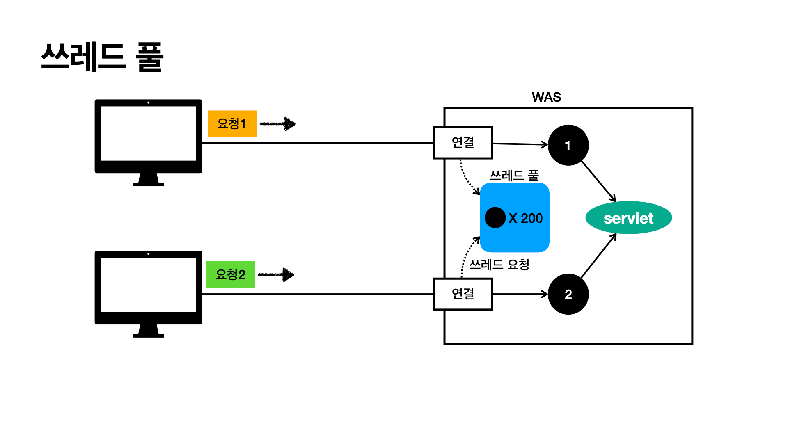
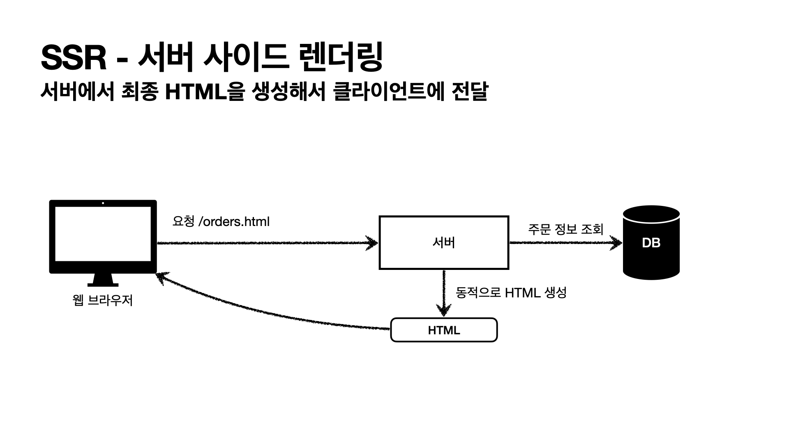

# Java-Spring-MVC1
# 1. 웹어플리케이션 
##  웹 서버, 웹 애플리케이션 서버
### 웹 - HTTP 기반 


### 모든것이 HTTP 
***HTTP 메시지에 모든 것을 전송***
- HTML, TEXT
- IMAGE, 음성, 영상, 파일
- JSON, XML (API)
- 거의 모든 형태의 데이터 전송 가능
- 서버간에 데이터를 주고 받을 때도 대부분 HTTP 사용

### 웹 서버(Web Server)
- HTTP 기반으로 동작
- 정적 리소스 제공, 기타 부가기능 
- 정적(파일) HTML, CSS, JS, 이미지, 영상 
- 예) NGINX, APACHE

.png)
### 웹 애플리케이션 서버(WAS - Web Application Server)
- HTTP 기반으로 동작 
- 웹 서버 기능 포함+ (정적 리소스 제공 가능) 
- 프로그램 코드를 실행해서 애플리케이션 로직 수행
  - 동적 HTML, HTTP API(JSON)
  - 서블릿, JSP, 스프링 MVC
- 예) 톰캣(Tomcat) Jetty, Undertow
.png)
### 웹 서버, 웹 애플리케이션 서버(WAS) 차이
- 웹 서버는 정적 리소스(파일), WAS는 애플리케이션 로직 
- 사실은 둘의 용어도 경계도 모호함
  - 웹 서버도 프로그램을 실행하는 기능을 포함하기도 함
  - 웹 애플리케이션 서버도 웹 서버의 기능을 제공함 
- 자바는 서블릿 컨테이너 기능을 제공하면 WAS
  - 서블릿 없이 자바코드를 실행하는 서버 프레임워크도 있음
- WAS는 애플리케이션 코드를 실행하는데 더 특화 

### 웹 시스템 구성 - WAS, DB
- WAS, DB 만으로 시스템 구성 가능
- WAS는 정적 리소스, 애플리케이션 로직 모두 제공 가능


- WAS가 너무 많은 역할을 담당, 서버 과부하 우려
- 가장 비싼 애플리케이션 로직이 정적 리소스 때문에 수행이 어려울 수 있음 
- WAS 장애시 오류 화면도 노출 불가능


- WAS가 너무 많은 역할을 담당, 서버 과부하 우려
- 가장 비싼 애플리케이션 로직이 정적 리소스 때문에 수행이 어려울 수 있음 
- WAS 장애시 오류 화면도 노출 불가능


### 웹 시스템 구성 - WEB, WAS, DB
- 정적 리소스는 웹 서버가 처리 
- 웹 서버는 애플리케이션 로직같은 동적인 처리가 필요하면 WAS에 요청을 위임 
- WAS는 중요한 애플리케이션 로직 처리 전담


- 효율적인 리소스 관리
  - 정적 리소스가 많이 사용되면 Web 서버 증설
  - 애플리케이션 리소스가 많이 사용되면 WAS 증설 


- 정적 리소스만 제공하는 웹 서버는 잘 죽지 않음 
- 애플리케이션 로직이 동작하는 WAS 서버는 잘 죽음 
- WAS, DB 장애시 WEB 서버가 오류 화면 제공 가능


## 서블릿 
### HTML Form 데이터 전송 : POST 전송 - 저장


### 서버에서 처리해야 하는 업무 : 웹 애플리케이션 서버 직접 구현 


### 서버에서 처리해야 하는 업무 : 서블릿을 지원하는 WAS 사용


### 서블릿 - 특징 
```
@WebServlet(name = "helloServlet", urlPatterns = "/hello")
public class HelloServlet extends HttpServlet {
@Override
protected void service(HttpServletRequest request, HttpServletResponse response){
//애플리케이션 로직
} }
```
- urlPatterns(/hello)의 URL이 호출되면 서블릿 코드가 실행
- HTTP 요청 정보를 편리하게 사용할 수 있는 HttpServletRequest 
- HTTP 응답 정보를 편리하게 제공할 수 있는 HttpServletResponse 
- 개발자는 HTTP 스펙을 매우 편리하게 사용

### 서블릿 - HTTP 요청, 응답 흐름
- HTTP 요청 시 
  - WAS는  Request, Response 객체를 새로 만들어서 서블릿 객체 호출
  - 개발자는 Request 객체에서 HTTP 요청 정보를 편리하게 꺼내서 사용 
  - 개발자는 Response 객체에 HTTP 응답 정보를 편리하게 입력
  - WAS는 Response 객체에 담겨있는 내용으로 HTTP 응답 정보를 생성

### 서블릿 컨테이너

### 서블릿 - 서블릿 컨테이너
- 톰캣처럼 서블릿을 지원하는 WAS를 서블릿 컨테이너라고 함
- 서블릿 컨테이너는 서블릿 객체를 생성, 초기화, 호출, 종료하는 생명주기 관리 
- 서블릿 객체는 싱글톤으로 관리
  - 고객의 요청이 올 때 마다 계속 객체를 생성하는 것은 비효율
  - 최초 로딩 시점에 서블릿 객체를 미리 만들어두고 재활용
  - 모든 고객 요청은 동일한 서블릿 객체 인스턴스에 접근
  - 공유 변수 사용 주의
  - 서블릿 컨테이너 종료시 함께 종료 
- JSP도 서블릿으로 변환 되어서 사용 
- 동시 요청을 위한 멀티 쓰레드 처리 지원


## 동시요청 - 멀티 쓰레드 


### 쓰레드 
- 애플리케이션 코드를 하나하나 순차적으로 실행하는 것은 쓰레드 
- 자바 메인 메서드를 처음 실행하면 main이라는 이름의 쓰레드가 실행 
- 쓰레드가 없다면 자바 애플리케이션 실행이 불가능
- 쓰레드는 한번에 하나의 코드 라인만 수행
- 동시 처리가 필요하면 쓰레드를 추가로 생성

### 단일 요청 - 쓰레드 하나 사용 
요청오면 연결 - 쓰레드 할당 -> 끝나면 쉬어


### 다중요청 
쓰레드가 1개이면 요청1이 연결해서 쓰레드를 사용중 처리지연되고 있다.
요청2는 쓰레드를 할당 받을 수 없게 된다. 
요청1, 요청 2 둘다 죽는다.


### 요청 마다 쓰레드 생성

- 장단점 
- 장점 
  - 동시 요청을 처리할 수 있다. 
  - 리소스(CPU, 메모리)가 허용할 때 까지 처리 가능
  - 하나의 쓰레드가 지연 되어도, 나머지 쓰레드는 정상 동작한다. 
- 단점
  - 쓰레드는 생성 비용은 매우 비싸다. 
    - 고객의 요청이 올때 마다 쓰레드를 생성하면, 응답 속도가 늦어진다. 
  - 쓰레드는 컨텍스트 스위칭 비용이 발생한다. 
  - 쓰레드 생성에 제한이 없다. 
    - 고객 요청이 너무 많이 오면, CPU

### 쓰레드 풀
요청1, 요청2가 오면 쓰레드풀에서 사용한다. -> 쓰레드 쓰고나면 쓰레드 풀에 반납한다. 
장점 : 요청이 쓰레드 풀보다 많은 요청이 오면 쓰레드 대기, 거절 가능할 수 있다.


### 쓰레드 풀 - 요청 마다 쓰레드 생성의 단점 보완
- 특징 
  - 필요한 쓰레드를 쓰레드 풀에 보관하고 관리한다. 
  - 쓰레드 풀에 생성 가능한 쓰레드의 최대치를 관리한다. 톰캣은 최대 200개 기본설정
- 사용 
  - 쓰레드가 필요하면, 이미 생성되어 있는 쓰레드를 쓰레드 풀에서 꺼내서 사용한다. 
  - 사용을 종료하면 쓰레드 풀에 해당 쓰레드를 반납한다. 
  - 최대 쓰레드가 모두 사용중이여서 쓰레드 풀에 쓰레드가 없으면
    - 기다리는 요청 

### 쓰레드 풀 - 실무팁
- was의 주요 튜닝 포인트는 최대 쓰레드(max thread) 수이다.
- 값을 너무 낮게 설정하면?
  - 동시 요청이 많으면, 서버 리소스는 여유롭지만, 클라이언트는 금방 응답 지연
- 값을 너무 높게 설정하면?
  - 동시요청이 많으면, CPU, 메모리 리소스 임계점 초과로 서버 다운
- 장애 발생시 ?
  - 클라우드면 일단 서버부터 늘리고, 이후에 튜닝
  - 클라우드가 아니면 평상시에.. 잘해야한다.

### 쓰레드 풀 - 너무 낮게 설정 


### 쓰레드 풀 - 쓰레드 풀의 적정 숫자 
- 적정숫자 찾는방법? 
- 애플리케이션 로직의 복잡도, CPU, 메모리, IO 리소스 상황에 따라 모두 다름
- 성능 테스트 
  - 최대한 실제 서비스와 유사하게 성능 테스트 시도
  - 툴 : 아파치 ab, 제이미터, nGrinder

### WAS의 멀티 쓰레드 지원 - 핵심
- 멀티 쓰레드에 대한 부분은 WAS가 처리 
- ***개발자가 멀티 쓰레드 관련 코드를 신경쓰지 않아도됨***
- 개발자는 마치 ***싱글 쓰레드 프로그래밍을 하듯이 편리하게 소스 코드를 개발***
- 멀티 쓰레드 환경이므로 싱글톤 객체(서블릿, 스프링 빈)는 주의해서 사용 

## HTML, HTTP API, CSR, SSR
### HTML 페이지 - 정적 페이지
- 고정된 HTML 파일, CSS, JS, 이미지, 영상 등을 제공 
- 주로 웹 브라우저

### HTML 페이지 - 동적 페이지
- 동적으로 필요한 HTML 파일을 생성해서 전달 
- 웹 브라우저 : HTML 해석

### HTTP API
- HTML이 아니라 데이터를 전달 
- 주로 JSON 형식 사용 
- 다양한 시스템에서 호출


- 데이터만 주고 받음, UI 화면이 필요하면, 클라이언트가 별도 처리 
- 앱, 웹 클라이언트 서버 to 서버

> ex) 데이터만 주세요 UI는 알아서 할게요 
> ex) 와스 서버가 데이터를 주면 자바스크립트에서 동적으로 만들어서 뿌린다.
> ex) 주문-결제 : 서버 to 서버 

### HTTP API - 다양한 시스템 연동
- 주로 JSON 형태로 데이터 통신 
- UI 클라이언트 접점 
  - 앱 클라이언트(아이폰, 안드로이드, )


### 서버사이드 렌더링, 클라이언트 랜더링 
- SSR - 서버 사이드 렌더링
  - HTML 최종 결과를 서버에서 만들어서 웹 브라우저에 전달 
  - 주로 정적인 화면에 사용
  - 관련기술: JSP, 타임리프 -> 백엔드 개발자
- CSR - 클라이언트 사이드 렌더링
  - HTML 결과를 자바스크립트를 사용해 
  - 웹 브라우저에서 동적으로 생성해서 적용 주로 동적인 화면에 사용, 웹 환경을 마치 앱 처럼 필요한 부분부분 변경할 수 있음 
  - 예) 구글 지도, Gmail, 구글 캘린더 
  - 관련기술: React, Vue.js -> 웹 프론트엔드 개발자
- 참고 
  - React, Vue.js를 CSR + SSR 동시에 지원하는 웹 프레임워크도 있음
  - SSR을 사용하더라도, 자바스크립트를 사용해서 화면 일부를 동적으로 변경 가능
### SSR - 서버 사이드 렌더링 
- 서버에서 최종 HTML을 생성해서 클라이언트에 전달


### CSR - 클라이언트 랜더링


### 어디까지 알아야 하나요? 
***백엔드 개발자 입장에서 UI 기술***

- 백엔드 - 서버 사이드 렌더링 기술
  - JSP, 타임리프
  - 화면이 정적이고, 복잡하지 않을 때 사용
  - 백엔드 개발자는 서버 사이드 렌더링 기술 학습 필수
- 웹 프론트엔드 - 클라이언트 사이드 렌더링 기술
  - React, Vue.js
  - 복잡하고 동적인 UI 사용
  - 웹 프론트엔드 개발자의 전문 분야
- 선택과 집중
  - 백엔드 개발자의 웹 프론트엔드 기술 학습은 옵션
  - 백엔드 개발자는 서버, DB, 인프라 등등 수 많은 백엔드 기술을 공부해야 한다. 
  - 웹 프론트엔드도 깊이있게 잘 하려면 숙련에 오랜 시간이 필요하다.


# 2. 서블릿 
## Hello 서블릿
스프링 부트 환경에서 서블릿 등록하고 사용해보자.
- 참고 : 서블릿은 톰캣 같은 웹 애플리케이션 서버를 직접 설치하고,그 위에 서블릿 코드를 클래스 파일로 빌드해서
  올린 다음, 톰캣 서버를 실행하면 된다. 하지만 이 과정은 매우 번거롭다. 스프링 부트는 톰캣 서버를 내장하고 있으므로, 톰캣 서버 설치 없이 편리하게 서블릿 코드를 실행할 수
있다.

### 스프링 부트 서블릿 환경 구성
```@ServletComponentScan```
스프링 부트는 서블릿을 직접 등록해서 사용할 수 있도록 ```@ServletComponentScan``` 을 지원한다. 다음과 같이 추가하자.

#### hello.servlet.ServletApplication
```
```


### 서블릿 등록하기
처음으로 실제 동작하는 서블릿 코드를 등록해보자. 

#### hello.servlet.basic.HelloServlet
```
package hello.servlet.basic;

import javax.servlet.ServletException;
import javax.servlet.annotation.WebServlet;
import javax.servlet.http.HttpServlet;
import javax.servlet.http.HttpServletRequest;
import javax.servlet.http.HttpServletResponse;
import java.io.IOException;

@WebServlet(name = "helloServlet", urlPatterns = "/hello")
// /hello 로 들어오면 아래 메서드가 실행
public class HelloServlet extends HttpServlet {
    @Override
    protected void service(HttpServletRequest request, HttpServletResponse response) throws ServletException, IOException {

        System.out.println("HelloServlet.service");
        System.out.println("request = " + request);
        System.out.println("response = " + response);
        String username = request.getParameter("username");
        System.out.println("username = " + username);
        // 헤더정보에 들어감
        response.setContentType("text/plain");
        response.setCharacterEncoding("utf-8");
        response.getWriter().write("hello " + username);
    }
}

```

- @WebServlet 서블릿 애노테이션 
  - name: 서블릿 이름 
  - urlPatterns: URL 매핑git

HTTP 요청을 통해 매핑된 URL이 호출되면 서블릿 컨테이너는 다음 메서드를 실행한다.
protected void service(HttpServletRequest request, HttpServletResponse response)

- 웹 브라우저 실행
  - http://localhost:8080/hello?username=spring
  - 결과: hello world
- 콘솔 실행결과

```
HelloServlet.service
request = org.apache.catalina.connector.RequestFacade@45558806
response = org.apache.catalina.connector.ResponseFacade@204bbb8f
username = spring
```

### HTTP 요청 메시지 로그로 확인하기
```
// application.properties
logging.level.org.apache.coyote.http11=debug
```

### 서블릿 컨테이너 동작 방식 설명
#### 내장 톰캣 서버 생성
#### HTTP 요청, HTTP 응답 메시지
#### 웹 애플리케이션 서버의 요청 응답 구조
- 참고 : HTTP 응답에서 Content-Length는 웹 애플리케이션 서버가 자동으로 생성해준다.

### welcome 페이지 추가
지금부터 개발할 내용을 편리하게 참고할 수 있도록 welcome 페이지를 만들어두자.
```webapp``` 경로에 ```index.html``` 을 두면 ```http://localhost:8080``` 호출시 ```index.html``` 페이지가 열린다. 

- ```main/webapp/index.html```
```
```

- 이번 장에서 학습할 내용은 다음 ```basic.html``` 이다. 
- ```main/webapp/basic.html```
```

```

## HttpServletRequest - 개요

### HttpServletRequest 역할
HTTP 요청 메시지를 개발자가 직접 파싱해서 사용해도 되지만, 매우 불편할 것이다. 서블릿은 개발자가 HTTP 요청 메시지를 편리하게 사용할 수 있도록 개발자 대신에 HTTP 요청 메시지를 파싱한다. 그리고 그 결과를 HttpServletRequest 객체에 담아서 제공한다.

```HttpServletRequest```를 사용하면 다음과 같은 HTTP 요청 메시지를 편리하게 조회할 수 있다. 

#### HTTP 요청 메시지
```
POST /save HTTP/1.1
  Host: localhost:8080
  Content-Type: application/x-www-form-urlencoded
  
  username=kim&age=20 // 바디
```
- START LINE 
  - HTTP 메소드
  - URL
  - 쿼리 스트링
  - 스키마, 프로토콜 
- 헤더
  - 헤더 조회 
- 바디 
  - form 파라미터 형식 조회 
  - message body 데이터 직접 조회
    
HttpServletRequest 객체는 추가로 여러가지 부가기능도 함께 제공한다.


#### 임시 저장소 기능
- 해당 HTTP 요청이 시작부터 끝날 때 까지 유지되는 임시 저장소 기능 
  - 저장: ```request.setAttribute(name, value)```
  - 조회: ```request.getAttribute(name)```

- 세션 관리 기능
  - ```request.getSession(create: true)```

- 중요 : ```HttpServletRequest```, ```HttpServletResponse```를 사용할 때 가장 중요한 점은 이 객체들이 HTTP 요청 메시지, HTTP 응답 메시지를 편리하게 사용하도록 도와주는 객체라는 점이다. 따라서 이 기능에 대해서 깊이있는 이해를 하려면 HTTP 스펙이 제공하는 요청, 응답 메시지 자체를 이해해야 한다.

## HttpServletRequest - 기본 사용법
HttpServletRequest가 제공하는 기본 기능들을 알아보자.

### hello.servlet.basic.request.RequestHeaderServlet
```
@WebServlet(name = "requestHeaderServlet", urlPatterns = "/request-header")
public class RequestHeaderServlet extends HttpServlet {

    @Override
    protected void service(HttpServletRequest request, HttpServletResponse response) throws ServletException, IOException {
        printStartLine(request);
        printHeaders(request);
        printHeaderUtils(request);
        printEtc(request);
        response.getWriter().write("ok");

    }
    
```

### start-line 정보
```
private void printStartLine(HttpServletRequest request){

        System.out.println("--- REQUEST-LINE - start ---");
        System.out.println("request.getMethod() = " + request.getMethod()); //GET
        System.out.println("request.getProtocol() = " + request.getProtocol()); //HTTP/1.1
        System.out.println("request.getScheme() = " + request.getScheme()); //http
        // http://localhost:8080/request-header
        System.out.println("request.getRequestURL() = " + request.getRequestURL());
        // /request-header
        System.out.println("request.getRequestURI() = " + request.getRequestURI());
        //username=hi
        System.out.println("request.getQueryString() = " +
                request.getQueryString());
        System.out.println("request.isSecure() = " + request.isSecure()); //https사용 유무
        System.out.println("--- REQUEST-LINE - end ---");
        System.out.println();
    }
```

### 결과 

```
--- REQUEST-LINE - start ---
request.getMethod() = GET
request.getProtocol() = HTTP/1.1
request.getScheme() = http
request.getRequestURL() = http://localhost:8080/request-header
request.getRequestURI() = /request-header
request.getQueryString() = username=hello
request.isSecure() = false
--- REQUEST-LINE - end ---
```

### 헤더 정보 
```
private void printHeaders(HttpServletRequest request) {
        System.out.println("--- Headers - start ---");
  /*
      Enumeration<String> headerNames = request.getHeaderNames();
      while (headerNames.hasMoreElements()) {
          String headerName = headerNames.nextElement();
          System.out.println(headerName + ": " + request.getHeader(headerName));
      }
*/
        request.getHeaderNames().asIterator()
                .forEachRemaining(headerName -> System.out.println(headerName + " : " + request.getHeader(headerName)));
        System.out.println("--- Headers - end ---");
        System.out.println();
    }
```

### 결과 

```
--- Headers - start ---
content-type : text/plain
user-agent : PostmanRuntime/7.30.0
accept : */*
postman-token : e41e4f9a-4dd7-422e-83be-417c5de201fc
host : localhost:8080
accept-encoding : gzip, deflate, br
connection : keep-alive
content-length : 5
--- Headers - end ---
```

### Header 편리한 조회
```
 private void printHeaderUtils(HttpServletRequest request) {
        System.out.println("--- Header 편의 조회 start ---");
        System.out.println("[Host 편의 조회]"); System.out.println("request.getServerName() = " +
                request.getServerName()); //Host 헤더
        System.out.println("request.getServerPort() = " +
        request.getServerPort()); //Host 헤더
        System.out.println();

        System.out.println("[Accept-Language 편의 조회]");
        request.getLocales().asIterator()
                .forEachRemaining(locale -> System.out.println("locale = " +locale));
                        System.out.println("request.getLocale() = " + request.getLocale()); // 가장 위에있는 정보를 꺼내기
        System.out.println();

        // 쿠키정보 꺼내기
        System.out.println("[cookie 편의 조회]"); if (request.getCookies() != null) {
            for (Cookie cookie : request.getCookies()) {
                System.out.println(cookie.getName() + ": " + cookie.getValue());
            } }
        System.out.println();

        // get방식일 경우 ContentType -> NULL
        System.out.println("[Content 편의 조회]");
        System.out.println("request.getContentType() = " +
                request.getContentType());
        System.out.println("request.getContentLength() = " + request.getContentLength());
        System.out.println("request.getCharacterEncoding() = " +
                request.getCharacterEncoding());
        System.out.println("--- Header 편의 조회 end ---");
        System.out.println();
    }
```

### 결과 
```
--- Header 편의 조회 start ---
[Host 편의 조회]
request.getServerName() = localhost
request.getServerPort() = 8080

[Accept-Language 편의 조회]
locale = ko_AU
request.getLocale() = ko_AU

[cookie 편의 조회]

[Content 편의 조회]
request.getContentType() = text/plain
request.getContentLength() = 5
request.getCharacterEncoding() = UTF-8
--- Header 편의 조회 end ---
```

### 기타 정보
기타 정보는 HTTP 메시지의 정보는 아니다.
```
private void printEtc(HttpServletRequest request) { System.out.println("--- 기타 조회 start ---");
        System.out.println("[Remote 정보]");
        System.out.println("request.getRemoteHost() = " +
                request.getRemoteHost()); //
        System.out.println("request.getRemoteAddr() = " +
                request.getRemoteAddr()); //
        System.out.println("request.getRemotePort() = " +
                request.getRemotePort()); //
        System.out.println();


        System.out.println("[Local 정보]");
        System.out.println("request.getLocalName() = " +
                request.getLocalName()); //
        System.out.println("request.getLocalAddr() = " +
                request.getLocalAddr()); //
        System.out.println("request.getLocalPort() = " +
                request.getLocalPort()); //
        System.out.println("--- 기타 조회 end ---");
        System.out.println();
    }
```

### 결과 
```
--- 기타 조회 start ---
[Remote 정보]
request.getRemoteHost() = 0:0:0:0:0:0:0:1
request.getRemoteAddr() = 0:0:0:0:0:0:0:1
request.getRemotePort() = 59684

[Local 정보]
request.getLocalName() = localhost
request.getLocalAddr() = 0:0:0:0:0:0:0:1
request.getLocalPort() = 8080
--- 기타 조회 end ---
```

- 참고 : 로컬에서 테스트하면 IPv6 정보가 나오는데, IPv4 정보를 보고 싶으면 다음 옵션을 VM options에
넣어주면 된다. 
  - Djava.net.preferIPv4Stack=true

지금까지 HttpServletRequest를 통해서 HTTP 메시지의 start-line, header 정보 조회 방법을 이해했다. 이제 본격적으로 HTTP 요청 데이터를 어떻게 조회하는지 알아보자.

## HTTP 요청 데이터 - 개요
HTTP 요청 메시지를 통해 클라이언트에서 서버로 데이터를 전달하는 방법을 알아보자.
***주로 다음 3가지 방법을 사용한다.***

- GET - 쿼리 파라미터
  - /url?username=hello&age=20
  - 메시지 바디 없이, URL의 쿼리 파라미터에 데이터를 포함해서 전달 
  - 예) 검색, 필터, 페이징등에서 많이 사용하는 방식

- POST - HTML Form
  - content-type: application/x-www-form-urlencoded
  - 메시지 바디에 쿼리 파리미터 형식으로 전달 username=hello&age=20 
  - 예) 회원 가입, 상품 주문, HTML Form 사용

- HTTP message body에 데이터를 직접 담아서 요청 
  - HTTP API에서 주로 사용, JSON, XML, TEXT

- 데이터 형식은 주로 JSON 사용 
  - POST, PUT, PATCH

- POST- HTML Form 예시

## HTTP 요청 데이터 - GET 쿼리 파라미터
다음 데이터를 클라이언트에서 서버로 전송해보자.
전달 데이터
- username=hello 
- age=20

메시지 바디 없이, URL의 쿼리 파라미터를 사용해서 데이터를 전달하자. 
예) 검색, 필터, 페이징등에서 많이 사용하는 방식

쿼리파라미터는URL에다음과같이 ?를시작으로보낼수있다.추가파라미터는 &로구분하면된다. 
- http://localhost:8080/request-param?username=hello&age=20

서버에서는 HttpServletRequest 가 제공하는 다음 메서드를 통해 쿼리 파라미터를 편리하게 조회할 수 있다.

### 쿼리 파라미터 조회 메서드
```
```

### RequestParamServlet
```
```

### 실행 - 파라미터 전송

### 결과
```
```

### 복수 파라미터에서 단일 파라미터 조회
username=hello&username=kim 과 같이 파라미터 이름은 하나인데, 값이 중복이면 어떻게 될까? request.getParameter() 는 하나의 파라미터 이름에 대해서 단 하나의 값만 있을 때 사용해야 한다. 지금처럼 중복일 때는 request.getParameterValues() 를 사용해야 한다.
참고로 이렇게 중복일 때 request.getParameter() 를 사용하면 request.getParameterValues() 의 첫 번째 값을 반환한다.

## HTTP 요청 데이터 - POST HTML Form
이번에는 HTML의 Form을 사용해서 클라이언트에서 서버로 데이터를 전송해보자.
주로 회원 가입, 상품 주문 등에서 사용하는 방식이다.

- 특징
  - content-type: application/x-www-form-urlencoded
  - 메시지 바디에 쿼리 파리미터 형식으로 데이터를 전달한다. username=hello&age=20


### src/main/webapp/basic/hello-form.html 생성
```
```

### 실행
- http://localhost:8080/basic/hello-form.html

### 주의 
- 웹 브라우저가 결과를 캐시하고 있어서, 과거에 작성했던 html 결과가 보이는 경우도 있다. 이때는 웹
브라우저의 새로 고침을 직접 선택해주면 된다. 물론 서버를 재시작 하지 않아서 그럴 수도 있다.
- POST의 HTML Form을 전송하면 웹 브라우저는 다음 형식으로 HTTP 메시지를 만든다. (웹 브라우저 개발자 모드 확인)

- 요청 URL: http://localhost:8080/request-param
- content-type: ```application/x-www-form-urlencoded```
- message body: ```username=hello&age=20```

application/x-www-form-urlencoded 형식은 앞서 GET에서 살펴본 쿼리 파라미터 형식과 같다. 따라서 쿼리 파라미터 조회 메서드를 그대로 사용하면 된다.
클라이언트(웹 브라우저) 입장에서는 두 방식에 차이가 있지만, 서버 입장에서는 둘의 형식이 동일하므로, request.getParameter() 로 편리하게 구분없이 조회할 수 있다.
정리하면 request.getParameter() 는 GET URL 쿼리 파라미터 형식도 지원하고, POST HTML Form 형식도 둘 다 지원한다.

- 참고 : content-type은 HTTP 메시지 바디의 데이터 형식을 지정한다.
GET URL 쿼리 파라미터 형식으로 클라이언트에서 서버로 데이터를 전달할 때는 HTTP 메시지 바디를
사용하지 않기 때문에 content-type이 없다.
POST HTML Form 형식으로 데이터를 전달하면 HTTP 메시지 바디에 해당 데이터를 포함해서 보내기
때문에 바디에 포함된 데이터가 어떤 형식인지 content-type을 꼭 지정해야 한다. 이렇게 폼으로 데이터를 전송하는 형식을 application/x-www-form-urlencoded 라 한다.


### Postman을 사용한 테스트
이런 간단한 테스트에 HTML form을 만들기는 귀찮다. 이때는 Postman을 사용하면 된다.

- Postman 테스트 주의사항 
  - POST 전송시
    - Body x-www-form-urlencoded 선택
    - Headers에서 content-type: application/x-www-form-urlencoded 로 지정된 부분 꼭 확인

## HTTP 요청 데이터 - API 메시지 바디 - 단순 텍스트
- HTTP message body에 데이터를 직접 담아서 요청
  - HTTP API에서 주로 사용, JSON, XML, TEXT 
  - 데이터 형식은 주로 JSON 사용
  - POST, PUT, PATCH
- 먼저 가장 단순한 텍스트 메시지를 HTTP 메시지 바디에 담아서 전송하고, 읽어보자. 
- HTTP 메시지 바디의 데이터를 InputStream을 사용해서 직접 읽을 수 있다.

### RequestBodyStringServlet
```
```

- 참고 : inputStream은 byte 코드를 반환한다. byte 코드를 우리가 읽을 수 있는 문자(String)로 보려면 문자표
(Charset)를 지정해주어야 한다. 여기서는 UTF_8 Charset을 지정해주었다.

문자 전송
- POST http://localhost:8080/request-body-string 
- content-type: text/plain
- message body: hello
- 결과: messageBody = hello

## HTTP 요청 데이터 - API 메시지 바디 - JSON
이번에는 HTTP API에서 주로 사용하는 JSON 형식으로 데이터를 전달해보자.

- JSON 형식 전송
  - POST http://localhost:8080/request-body-json 
  - content-type: application/json
  - message body: {"username": "hello", "age": 20} 
  - 결과: messageBody = {"username": "hello", "age": 20}

- JSON 형식 파싱 추가
  - JSON 형식으로 파싱할 수 있게 객체를 하나 생성하자

### hello.servlet.basic.HelloData
```
```

```
```

```
```

Postman으로 실행해보자.
- POST http://localhost:8080/request-body-json
- content-type: application/json (Body raw, 가장 오른쪽에서 JSON 선택) 
- message body: {"username": "hello", "age": 20}

### 출력 
```
```

- 참고 : JSON 결과를 파싱해서 사용할 수 있는 자바 객체로 변환하려면 Jackson, Gson 같은 JSON 변환
  라이브러리를 추가해서 사용해야 한다. 스프링 부트로 Spring MVC를 선택하면 기본으로 Jackson 라이브러리( ObjectMapper )를 함께 제공한다.
- 참고 : HTML form 데이터도 메시지 바디를 통해 전송되므로 직접 읽을 수 있다. 하지만 편리한 파리미터 조회
  기능( request.getParameter(...) )을 이미 제공하기 때문에 파라미터 조회 기능을 사용하면 된다.

## HttpServletResponse - 기본 사용법
### HttpServletResponse 역할
HTTP 응답 메시지 생성 
- HTTP 응답코드 지정 
- 헤더 생성
- 바디 생성
편의 기능 제공
- Content-Type, 쿠키, Redirect

### HttpServletResponse - 기본 사용법
#### hello.servlet.basic.response.ResponseHeaderServlet
```
```

#### Content 편의 메서드 
```
```

#### 쿠키 편의 메서드 
```
```

#### redirect 편의 메서드 
```
```

## HTTP 응답 데이터 - 단순 텍스트, HTML 
HTTP 응답 메시지는 주로 다음 내용을 담아서 전달한다.
- 단순 텍스트 응답
  - 앞에서 살펴봄 ( writer.println("ok"); )
- HTML 응답
- HTTP API - MessageBody JSON 응답

### HttpServletResponse - HTML 응답 
#### hello.servlet.web.response.ResponseHtmlServlet
```
```

#### 실행 
- http://localhost:8080/response-html
- 페이지 소스보기를 사용하면 결과 HTML을 확인할 수 있다.

## HTTP 응답 데이터 - API JSON 
### hello.servlet.web.response. ResponseJsonServlet
```
```
HTTP 응답으로 JSON을 반환할 때는 content-type을 application/json 로 지정해야 한다. Jackson 라이브러리가 제공하는 objectMapper.writeValueAsString() 를 사용하면 객체를 JSON 문자로 변경할 수 있다.

### 실행 
- http://localhost:8080/response-json

- 참고 : application/json 은 스펙상 utf-8 형식을 사용하도록 정의되어 있다. 그래서 스펙에서 charset=utf-8
  과 같은 추가 파라미터를 지원하지 않는다. 따라서 application/json 이라고만 사용해야지  application/json;charset=utf-8 이라고 전달하는 것은 의미 없는 파라미터를 추가한 것이 된다. > response.getWriter()를 사용하면 추가 파라미터를 자동으로 추가해버린다. 이때는
response.getOutputStream()으로 출력하면 그런 문제가 없다.